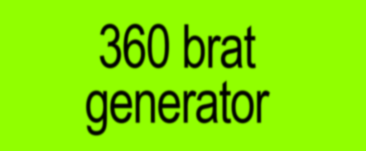
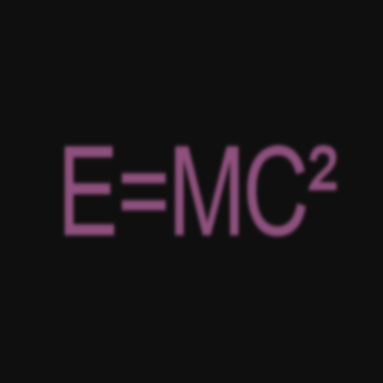

# 360 BRAT Generator



Inspired by Charli xcx’s [bratgenerator.com](https://www.bratgenerator.com/), **360 brat generator** features an
improved layout with dynamic features, allowing users 
to customize background and text colors. '360' 
represents its ability to customize the generator at all
aspects *(colors)* and of course, Charli's iconic intro for BRAT album 360.

## Features
- Customizable background and text colors using RGB, HSL, and Hex Code.
- Multi-line text support (up to 6 lines).
- Responsive design.
- Improved BRAT font (90% stretched text and blurred visual).

## Purpose
Personally, I built this project to familiarize and strengthen the fundamentals of HTML, CSS, and JavaScript. On the other hand, the idea was to make customizing BRAT fonts easier without using image editors such as Photoshop or PicsArt. This project also serves as a portfolio piece to showcase alongside our other work.
This project helped me practice clean, interactive design and improve my web development skills.  I’m looking for ways to enhance the app and grow further as programmer.

Example usage:
<br>
E=MC² *(Studio Album by Mariah Carey)*            |  E=MC² in BRAT style
:-------------------------:|:-------------------------:
  |  


---
## Usage & Distribution
This project's code is publicly available on GitHub for learning and demonstration purposes only. 
While others can clone and run locally, it should not be deployed as a public web service 
out of respect for the original BRAT generator.

## Disclaimer 🔴
This is a fan-made project and is not affiliated with, endorsed, or sponsored by Charli xcx 
or her team. This project was created for educational purposes and out of appreciation
for the artist's work. The original BRAT concept and design belong to Charli xcx. Visit the original BRAT generator [here](https://www.bratgenerator.com/).

The code in this repository is for:
- Learning purposes
- Local development only
- GitHub portfolio demonstration
- Personal use

## Requirements
- Code Editor/IDE
- Web browser (Chrome recommended)
- Live Server Extension

## Installation
1. Clone the repository:
    ```bash
    git clone https://github.com/romanjosephgallardo/360-brat-generator.git
    cd 360-brat-generator
    ```

2. Open the project in your code editor.

### Running the Static Site
1. Open `index.html` in your code editor.

2. Use the Live Server extension in Visual Studio Code to view the site locally:
    - Install the Live Server extension if you haven't already.
    - Right-click on `index.html` and select "Open with Live Server".
    - Alternatively, click the "Go Live" button at the bottom-right corner of Visual Studio Code.

3. Your default web browser should open a new tab with the URL `http://127.0.0.1:5500` (or similar).

### Note
- Ensure all assets (CSS, JavaScript, images) are in the correct directories.
- Test the site locally before deploying to GitHub Pages.

---