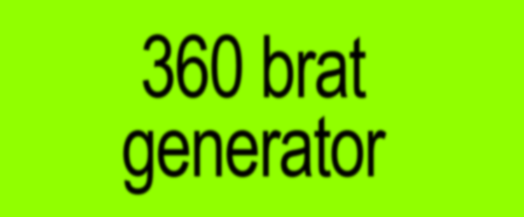

# 360 BRAT Generator



Inspired by Charli xcx’s [bratgenerator.com](https://www.bratgenerator.com/), **360 brat generator** features an
improved layout with dynamic features, allowing users 
to customize background and text colors. '360' 
represents its ability to customize the generator at all
aspects *(colors)* and of course, Charli's iconic intro for BRAT album 360.

## Features
- Customizable background and text colors using RGB, HSL, and Hex Code.
- Multi-line text support (up to 6 lines).
- Responsive design.
- Improved BRAT font (90% stretched text and blurred visual).

## Purpose
Personally, I built this project to familiarize and strengthen the fundamentals of HTML, CSS, and JavaScript. On the other hand, the idea was to make customizing BRAT fonts easier without using image editors such as Photoshop or PicsArt. This helped me practice clean, interactive design and improve my web development skills.  I’m looking for ways to enhance the app and grow further as programmer.

## Requirements
- Python 3.8 or higher
- Flask
- Web browser (Chrome recommended)

## Installation
1. Clone the repository:
    ```bash
    git clone https://github.com/romanjosephgallardo/360-brat-generator.git
    cd 360-brat-generator
    ```

2. Navigate to custom_brat_generator
    ```bash
    cd custom_brat_generator
    ```

3. Create and activate virtual environment:
    ```bash
    python -m venv venv
    .\venv\Scripts\activate
    ```

4. Install dependencies:
    ```bash
    pip install -r requirements.txt
    ```

### Running the Application
1. Ensure you're in the custom_brat_generator directory with venv activated:
    ```bash
    # You should see (venv) in your terminal
    cd custom_brat_generator
    .\venv\Scripts\activate
    ```
2. Run the Flask application:
    ```bash
    python run.py
    ```

3. Open your browser and navigate to:
   ```bash
   http://localhost:5000
   # For example: http://127.0.0.1:5000
   ```

### Note
- Virtual environment (venv) must be created inside custom_brat_generator folder
- Always activate venv before running the application
- Keep requirements.txt in the same directory as run.py

---